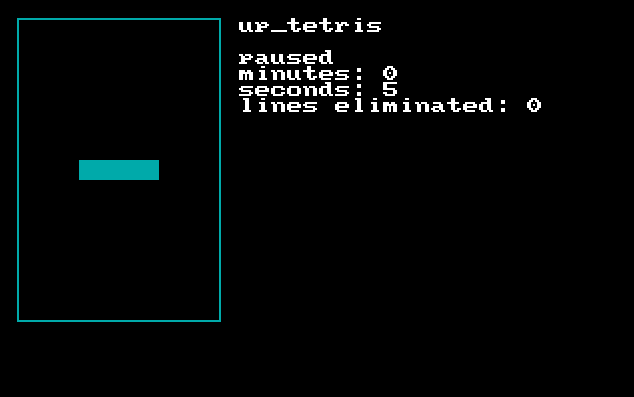

# Tetris

A tetris game made in assembly where the pieces go up instead of down

* [x] graphic mode 320x200, 256 colors
* [x] random generated blocks and go up
* [x] several pieces
* [x] collision
* [x] information about the time elapsed (minutes and seconds)
* [x] pause the game
* [x] number of lines eliminated
* [x] keyboard (j - move piece to left, l - move piece to right, i - rotate piece, k - accelarate piece movement, p - pause, q - quit)
* [x] mouse (left mouse - rotate piece)
